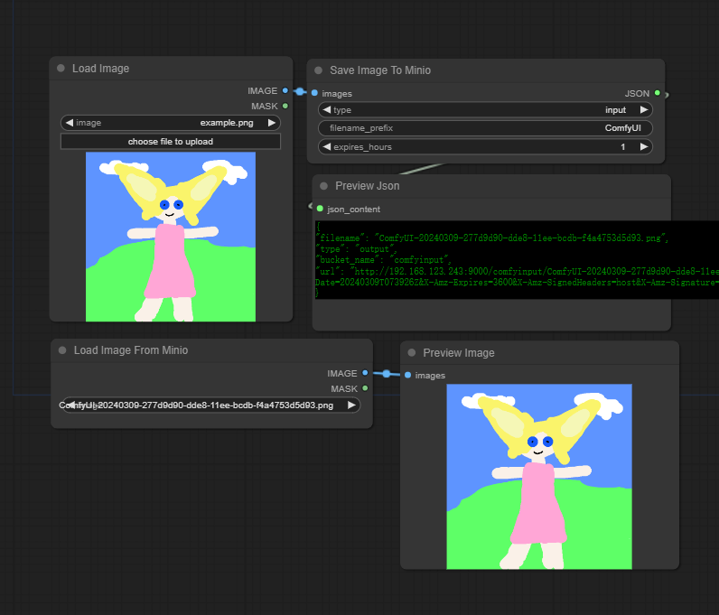

# Comfyui-Minio
This plugin is mainly based on Minio, implementing the ability to read images from Minio, save images, facilitating expansion and connection across multiple machines.

# Language

- [English](README.md)
- [简体中文](readme/README.zh_CN.md)

# Nodes

|Name                         |Description                                            |
|-----------------------------|-------------------------------------------------------|
|Set Minio Config             |Initialization of Minio.                               |
|Load Image From Minio        |Read images from Minio.                                |
|Save Image To Minio          |Save images to Minio, supports saving multiple images. |
|Workflow API                 |Send POST requests to workflow API endpoints.          |

# Install

This plugin requires installation of Minio's Python SDK

```
pip install -r requirements.txt
```

# Note
Before using, please initialize according to the steps below

## Using Workflow API Node

The Workflow API node allows you to send POST requests to workflow API endpoints. Here's how to use it:

1. Add the "Workflow API" node to your workflow
2. Configure the following parameters:
   - `api_url`: The URL of the workflow API endpoint (default: http://172.16.2.35/v1/workflows/run)
   - `api_key`: Your API key for authentication
   - `user_id`: User identifier (default: abc-123)
   - `inputs`: JSON string containing the inputs for the workflow (default: {})
   - `response_mode`: Choose between "streaming" or "blocking" mode

3. Connect the node to your workflow and run it
4. The node will return the API response as a string

## 1. Add node:Set Minio Config


## 2. Setting
Enter your Minio configuration information and run the plugin


Note: If you want to display JSON information, please install the plugin [Comfyui-Toolbox](https://github.com/zcfrank1st/Comfyui-Toolbox)

## 3. Check
If the Minio configuration is correct and can be connected successfully, a file will be created in the output directory

```
ComfyUI
    output
        minio_config.json
```

## 4. End
Now you can proceed to use the other two nodes as normal
